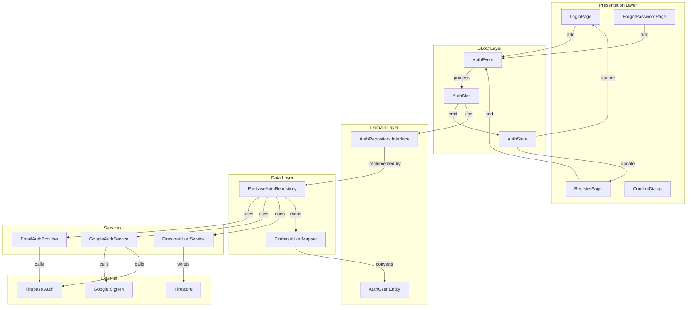

# Firebase BLoC Auth

A production-ready Flutter authentication module using **Clean Architecture** and **BLoC pattern**. Provides email/password and Google Sign-In with theme-aware UI components.

## Features

- **Email/Password Authentication** - Sign up, sign in, password reset
- **Google Sign-In** - OAuth authentication with silent sign-in support
- **Email Verification** - Built-in verification flow with countdown timer
- **Theme-Aware UI** - Pre-built pages that adapt to your app's theme
- **Clean Architecture** - Separation of domain, data, and presentation layers
- **Multi-Firebase Support** - Inject custom Firebase instances
- **Firestore Integration** - Optional user document synchronization
- **Comprehensive Error Handling** - Typed exceptions for all error cases

## Architecture Flowchart



## Installation

### 1. Add Dependencies

Add to your `pubspec.yaml`:

```yaml
dependencies:
  firebase_bloc_auth:
    path: ../remote_auth_module  # or use git/dependency_override
  
  # Required dependencies
  flutter_bloc: ^8.1.6
  firebase_core: ^3.6.0
  firebase_auth: ^5.3.3
  cloud_firestore: ^5.4.4
  google_sign_in: ^7.0.0
```

### 2. Firebase Setup

1. Create a Firebase project in [Firebase Console](https://console.firebase.google.com/)
2. Enable **Email/Password** and **Google** authentication methods
3. Download `google-services.json` (Android) and `GoogleService-Info.plist` (iOS)
4. Place them in respective platform folders

### 3. Google Sign-In Configuration

**Android:**
- Add your Web Client ID from Google Cloud Console when creating `FirebaseAuthRepository`

**iOS:**
- Add URL scheme in `Info.plist` for Google Sign-In

## Basic Usage

### 1. Dependency Injection Setup

```dart
// In your main.dart or DI setup (e.g., GetIt)
void setupDependencies() {
  // Register Firebase instances
  getIt.registerSingleton<FirebaseAuth>(FirebaseAuth.instance);
  getIt.registerSingleton<FirebaseFirestore>(FirebaseFirestore.instance);
  
  // Register AuthRepository
  getIt.registerSingleton<AuthRepository>(
    FirebaseAuthRepository(
      auth: getIt<FirebaseAuth>(),
      firestore: getIt<FirebaseFirestore>(),
      serverClientId: 'YOUR_WEB_CLIENT_ID', // Required for Android
      createUserCollection: true, // Optional: sync users to Firestore
      usersCollectionName: 'users',
    ),
  );
  
  // Register AuthBloc
  getIt.registerFactory<AuthBloc>(
    () => AuthBloc(repository: getIt<AuthRepository>())
      ..add(const InitializeAuthEvent()),
  );
}
```

### 2. Provide AuthBloc

```dart
class MyApp extends StatelessWidget {
  @override
  Widget build(BuildContext context) {
    return BlocProvider(
      create: (_) => getIt<AuthBloc>(),
      child: MaterialApp(
        title: 'My App',
        home: AuthGate(),
      ),
    );
  }
}
```

### 3. Auth Gate (Main Entry Point)

```dart
class AuthGate extends StatelessWidget {
  @override
  Widget build(BuildContext context) {
    return BlocBuilder<AuthBloc, AuthState>(
      builder: (context, state) {
        if (state is AuthLoadingState) {
          return const Scaffold(
            body: Center(child: CircularProgressIndicator()),
          );
        }
        
        if (state is AuthenticatedState) {
          return HomePage(user: state.user);
        }
        
        if (state is EmailVerificationRequiredState) {
          return VerificationPage(user: state.user);
        }
        
        // Show login page
        return LoginPage(
          onRegisterTap: () => Navigator.push(
            context,
            MaterialPageRoute(builder: (_) => RegisterPage()),
          ),
          onForgotPasswordTap: () => Navigator.push(
            context,
            MaterialPageRoute(builder: (_) => ForgotPasswordPage()),
          ),
          onAuthenticated: (state) => Navigator.pushReplacement(
            context,
            MaterialPageRoute(builder: (_) => HomePage(user: state.user)),
          ),
        );
      },
    );
  }
}
```

### 4. Available Events

```dart
// Sign in with email
context.read<AuthBloc>().add(
  SignInWithEmailEvent(email: 'user@example.com', password: 'password'),
);

// Register
context.read<AuthBloc>().add(
  RegisterWithEmailEvent(email: 'user@example.com', password: 'password'),
);

// Google Sign-In
context.read<AuthBloc>().add(SignInWithGoogleEvent());

// Sign out
context.read<AuthBloc>().add(SignOutEvent());

// Send email verification
context.read<AuthBloc>().add(SendEmailVerificationEvent());

// Reset password
context.read<AuthBloc>().add(
  SendPasswordResetEvent(email: 'user@example.com'),
);

// Update profile
context.read<AuthBloc>().add(UpdateDisplayNameEvent(name: 'John Doe'));
context.read<AuthBloc>().add(UpdatePasswordEvent(password: 'newpassword'));
```

## Key Components

### AuthUser
Domain entity representing authenticated user:
- `id` - Firebase UID
- `email` - User's email
- `displayName` - Optional display name
- `photoURL` - Optional profile photo
- `isEmailVerified` - Email verification status
- `providerIds` - List of auth providers (password, google.com, etc.)
- `isOAuthUser` - True if signed in via OAuth (Google, Apple, etc.)

### AuthRepository
Abstract interface for auth operations. Use `FirebaseAuthRepository` for Firebase implementation.

**Key Methods:**
- `signInWithEmailAndPassword()` - Email/password sign in
- `signUpWithEmailAndPassword()` - Create new account
- `signInWithGoogle()` - Google OAuth sign in
- `signOut()` - Sign out user
- `sendEmailVerification()` - Send verification email
- `sendPasswordResetEmail()` - Send password reset
- `updateDisplayName()` - Update user's display name
- `updatePassword()` - Update user's password

### AuthBloc
Main BLoC handling all authentication logic.

**Events:**
- `InitializeAuthEvent` - Initialize session on app start
- `SignInWithEmailEvent` - Email/password sign in
- `RegisterWithEmailEvent` - New account registration
- `SignInWithGoogleEvent` - Google sign in
- `SignOutEvent` - Sign out
- `SendEmailVerificationEvent` - Send verification email
- `SendPasswordResetEvent` - Send password reset
- `UpdateDisplayNameEvent` - Update display name
- `UpdatePasswordEvent` - Update password

**States:**
- `AuthInitialState` - Initial state
- `AuthLoadingState` - Loading in progress
- `AuthenticatedState` - User authenticated (with AuthUser)
- `UnauthenticatedState` - User not authenticated
- `AuthErrorState` - Error occurred (with message)
- `EmailVerificationRequiredState` - Registration complete, verification needed
- `EmailVerificationSentState` - Verification email sent
- `PasswordResetSentState` - Reset email sent
- `DisplayNameUpdatedState` - Display name updated
- `PasswordUpdatedState` - Password updated

### Exception Handling

All auth operations throw typed exceptions:

```dart
try {
  await repository.signInWithEmailAndPassword(email: email, password: password);
} on UserNotFoundException {
  // Show "Account not found" message
} on WrongPasswordException {
  // Show "Incorrect password" message
} on TooManyRequestsException {
  // Show rate limit message
} on AuthException catch (e) {
  // Handle any auth error with e.message
}
```

**Available Exceptions:**
- `UserNotFoundException`
- `WrongPasswordException`
- `EmailAlreadyInUseException`
- `WeakPasswordException`
- `InvalidEmailException`
- `TooManyRequestsException`
- `UserDisabledException`
- `RequiresRecentLoginException`
- `GoogleSignInCancelledException`
- `GoogleSignInConfigurationException`
- And more...

## Pre-built UI Components

### LoginPage
Theme-aware login screen with email/password and optional Google sign-in.

```dart
LoginPage(
  title: 'Welcome', // Optional: custom title
  logo: MyLogoWidget(), // Optional: custom logo
  showGoogleSignIn: true, // Optional: show/hide Google button
  onRegisterTap: () => Navigator.push(...),
  onForgotPasswordTap: () => Navigator.push(...),
  onAuthenticated: (state) => Navigator.pushReplacement(...),
)
```

### RegisterPage
Registration screen with email verification flow.

```dart
RegisterPage(
  title: 'Create Account',
  onLoginTap: () => Navigator.pop(context),
  onRegistered: (user) => Navigator.pushReplacement(...),
)
```

### ForgotPasswordPage
Password reset request screen.

```dart
ForgotPasswordPage(
  onResetSent: () => Navigator.pop(context),
)
```

### showAuthConfirmDialog
Reusable confirmation dialog.

```dart
final confirmed = await showAuthConfirmDialog(
  context,
  title: 'Log Out',
  message: 'Are you sure you want to log out?',
  confirmLabel: 'Log Out',
  confirmColor: Colors.red,
  icon: Icons.logout,
);

if (confirmed) {
  context.read<AuthBloc>().add(SignOutEvent());
}
```

## Configuration Options

### FirebaseAuthRepository Factory

```dart
FirebaseAuthRepository(
  // Optional: Custom FirebaseAuth instance (multi-app support)
  auth: FirebaseAuth.instance,
  
  // Optional: Custom Firestore instance
  firestore: FirebaseFirestore.instance,
  
  // Required for Android Google Sign-In
  serverClientId: 'YOUR_WEB_CLIENT_ID',
  
  // Optional: iOS/macOS client ID
  clientId: 'YOUR_IOS_CLIENT_ID',
  
  // Optional: Enable Firestore user document sync
  createUserCollection: true,
  
  // Optional: Custom collection name
  usersCollectionName: 'users',
)
```

## Firestore User Documents

When `createUserCollection: true`, user documents are created/updated automatically:

```
/users/{uid}
  - uid: string
  - email: string
  - displayName: string?
  - photoURL: string?
  - createdAt: timestamp (on first sign-in)
  - updatedAt: timestamp (on updates)
  - lastLoginAt: timestamp (on subsequent sign-ins)
```

## Security Rules

Add these Firestore security rules:

```javascript
rules_version = '2';
service cloud.firestore {
  match /databases/{database}/documents {
    match /users/{userId} {
      allow read, write: if request.auth != null && request.auth.uid == userId;
    }
  }
}
```

## Platform-Specific Notes

### Android
- Minimum SDK: 21
- Requires `serverClientId` for Google Sign-In
- Add `google-services.json` to `android/app/`

### iOS
- Minimum version: 12.0
- Add URL scheme for Google Sign-In in `Info.plist`
- Add `GoogleService-Info.plist` to `ios/Runner/`

## Example App

See the `example_app/` directory for a complete working example with:
- Dependency injection setup
- Auth gate implementation
- Navigation between pages
- Theme customization

## License

MIT License - See LICENSE file for details.

## Contributing

Contributions are welcome! Please ensure:
- Code follows existing patterns (Clean Architecture + BLoC)
- All public APIs are documented
- Error handling is comprehensive
- Tests are included for new features

---

**Need Help?** Check the example app or create an issue on GitHub.
